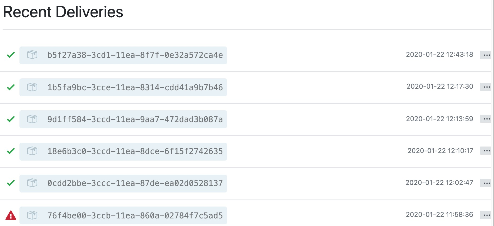

<!-- toc -->

# 自动化 VPS 部署

每次 GitHub 的内容更新后都需要自己手动部署一遍，非常的繁琐。这里主要讲如何在 VPS 上实现自动化部署流程。

主要的逻辑是在 GitHub 配置一个 Webhook 来监听 push 的操作，在 push 发生时 Github 就会发送一个 HTTP POST 请求到指定的 web url。在 VPS 上配置一个监听的程序，收到请求后执行自动构建 Gitbook 的脚本，实现自动更新。

1. 本地编写
2. git commit && git push
3. github 收到 push 请求，触发 webhook，发送一个 POST 请求到 VPS
4. VPS 监听到请求，自动执行脚本
5. 部署成功

## VPS 部署

### 监听程序

我们用第三方的库`github-webhook-handler`来接收参数并且做监听事件的处理等工作。
这个库是基于 node 环境的，服务器上如果还没有安装 node 的话可以参考这里。[CentOS 7 Node 安装](../DevOps/NodeInstall.md)

```bash
npm install github-webhook-handler
```

接下来是监听的 js 程序
`deploy.js`

```javascript
var http = require("http");
var createHandler = require("github-webhook-handler");
var handler = createHandler({
  path: "/",
  secret: "这里填写GitHub上设置的密钥"
});
// 上面的 secret 保持和 GitHub 后台设置的一致

function run_cmd(cmd, args, callback) {
  var spawn = require("child_process").spawn;
  var child = spawn(cmd, args);
  var resp = "";

  child.stdout.on("data", function(buffer) {
    resp += buffer.toString();
  });
  child.stdout.on("end", function() {
    callback(resp);
  });
}

http
  .createServer(function(req, res) {
    handler(req, res, function(err) {
      res.statusCode = 404;
      res.end("no such location");
    });
  })
  .listen(7777);
// 需要监听的端口号
handler.on("error", function(err) {
  console.error("Error:", err.message);
});

handler.on("push", function(event) {
  console.log(
    "Received a push event for %s to %s",
    event.payload.repository.name,
    event.payload.ref
  );
  run_cmd("sh", ["./deploy.sh", event.payload.repository.name], function(text) {
    console.log(text);
  });
});
```

### 执行脚本

部署 gitbook 的脚本 `deploy.sh`

```bash
#!/bin/bash

echo `date`
echo "Start deployment"
WEB_PATH='/root/data/Study_Record'
#填写项目所在的目录地址
cd $WEB_PATH

echo "pulling source code..."
git reset --hard origin/master
git clean -f
git pull
git checkout master

echo "start build"
gitbook build
#如果是监听端口的方式运行，这里使用gitbook serve，gitbook会在机器上的4000端口运行
echo "Finished."
```

### 后台运行

脚本的后台持久化需要借助 Node 中的一个管理 `forever` 。forever 可以看做是一个 nodejs 的守护进程，能够启动，停止，重启我们的 app 应用。

安装`forever`

```bash
npm install forever -g
```

运行监听程序

```bash
forever start deploy.js
```

### Nginx 代理静态网页

[CentOS 7 Nginx 安装](../DevOps/NginxInstall.md)

代理静态网页和代理端口以下方式二选一，推荐使用代理网页的方式

打开 nginx 配置文件

```bash
vim /etc/nginx/nginx.conf
```

修改 server 下的根目录，指向 Git 项目所在的路径下的\_book 文件夹
执行完`gitbook build` 后会在该文件夹下创建一个静态网页
对根目录配置权限 `chmod -R 755 根目录路径`

```nginx
    server {
        listen       80 default_server;
        listen       [::]:80 default_server;
        server_name  _;
        root         git项目所在的根目录/_book;
        index       index.html;

```

配置完后如果发现无法访问（错误代码 403），可能是服务器开启了 SELINUX，关闭即可

### Nginx 代理端口

打开 nginx 配置文件

```bash
vim /etc/nginx/nginx.conf
```

修改 server 下的 location，4000 为 gitbook serve 使用的端口

```nginx
        location / {
                proxy_pass http://localhost:4000;
                proxy_http_version 1.1;
                proxy_set_header Upgrade $http_upgrade;
                proxy_set_header Connection 'upgrade';
                proxy_set_header Host $host;
                proxy_cache_bypass $http_upgrade;
        }
```

## 配置 Github 的 webhooks

打开 repo 的主页，Setting --> Webhooks --> Add webhook

- Payload URL : ip 或者 域名 + 监听端口, VPS 上监听的是 7777 端口：http://shuoweiwu.xyz:7777,
- Content Type : application/json
- Secret : 保持与`deploy.js`中一致

剩下的默认保持 push event 就可以了。

### 测试 Webhooks

完成上述全部步骤后基本就完成了 Gitbook 的自动化部署，push 后在 Setting --> Webhooks 里可以看到是否推送成功。失败和成功都会有信息提醒。


