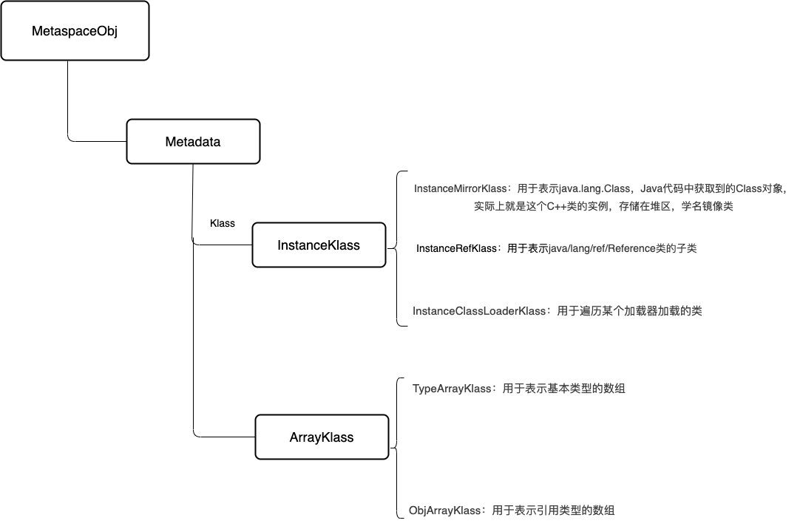
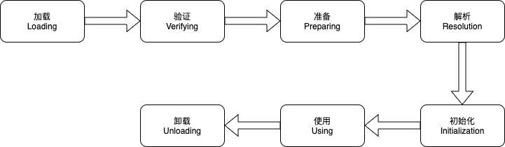
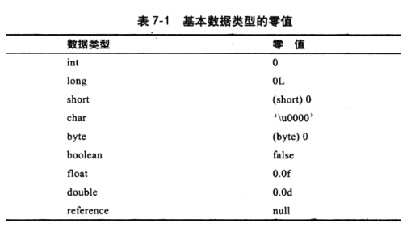

# JVM 类加载

## Klass 模型
* 普通的Java类在JVM中对应的是instanceKlass类的实例
* Java中的数组不是静态数据类型，是动态数据类型，即运行时生成的，Java数组的元信息用ArrayKlass的子类来表示

## 类加载过程
类加载生命周期：

* 通过类的全限定名获取存储该类的class文件
* 解析成运行时数据，即instanceKlass实例，存放在方法区
* 在堆区生成该类的Class对象，即instanceMirrorKlass实例
### 加载时机
* 主动使用时加载：
1. new、getstatic、putstatic、invokestatic
2. 反射
3. 初始化一个类的子类时会自动加载其父类
4. 启动类（main函数所在类）
5. 当使用jdk1.7动态语言支持时，如果一个java.lang.invoke.MethodHandle实例最后的解析结果REF_getstatic,REF_putstatic,REF_invokeStatic的方法句柄，并且这个方法句柄所对应的类没有进行初始化，则需要先出触发其初始化

* 预加载：
包装类、String、Thread

## 验证
* 文件格式验证
* 元数据验证
* 字节码验证
* 符号引用验证

## 准备
* 为静态变量分配内存、赋初值
* 实例变量在创建对象的时候完成赋值
* 被final修饰的值在编译的时候会给属性添加ConstantValue属性，准备阶段直接完成赋值，即没有赋初值这一步。

## 解析
将常量池中的符号引用转为直接引用
解析后的信息存储在ConstantPoolCache类实例中
解析包含：
1. 类或接口的解析
2. 字段解析
3. 方法解析
4. 接口方法解析
### 解析时机：
* 加载阶段解析常量池时
* 被使用时

## 初始化
* 执行静态代码块，完成静态变量的赋值
* 静态字段、静态代码段，字节码层面会生成clinit方法
* 方法中语句的先后顺序与代码的编写顺序相关

## ConstantPoolCache
常量池缓存是为常量池预留的运行时的数据结构。保存所有字段访问和调用字节码的解释器运行时信息。缓存是在类被积极使用之前创建和初始化的。每个缓存项在解析时被填充。