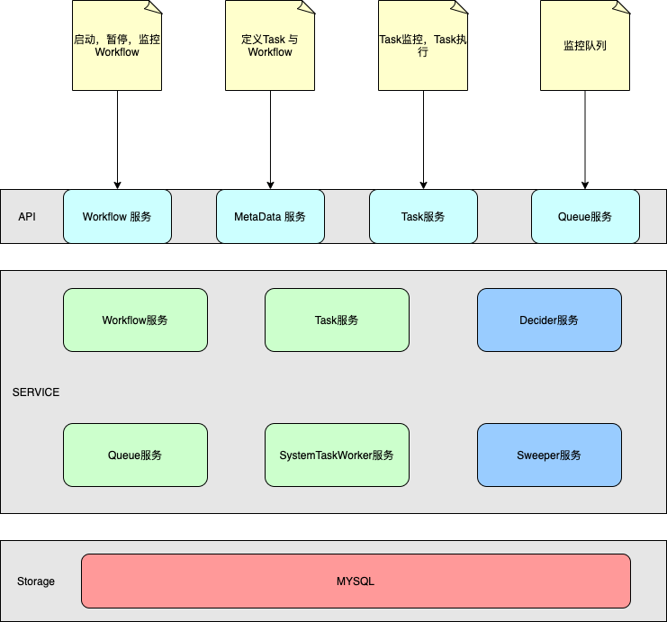
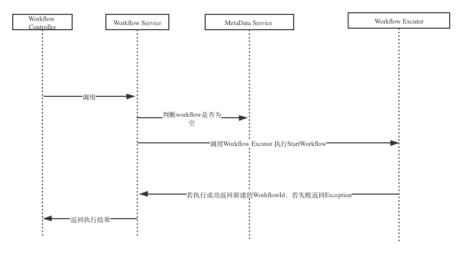
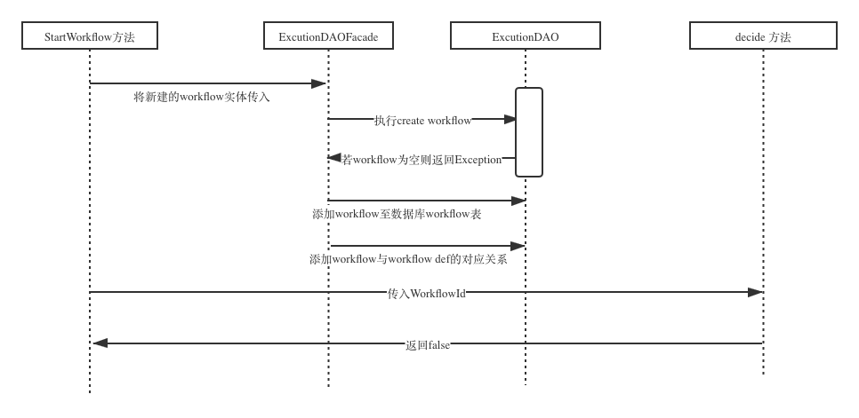
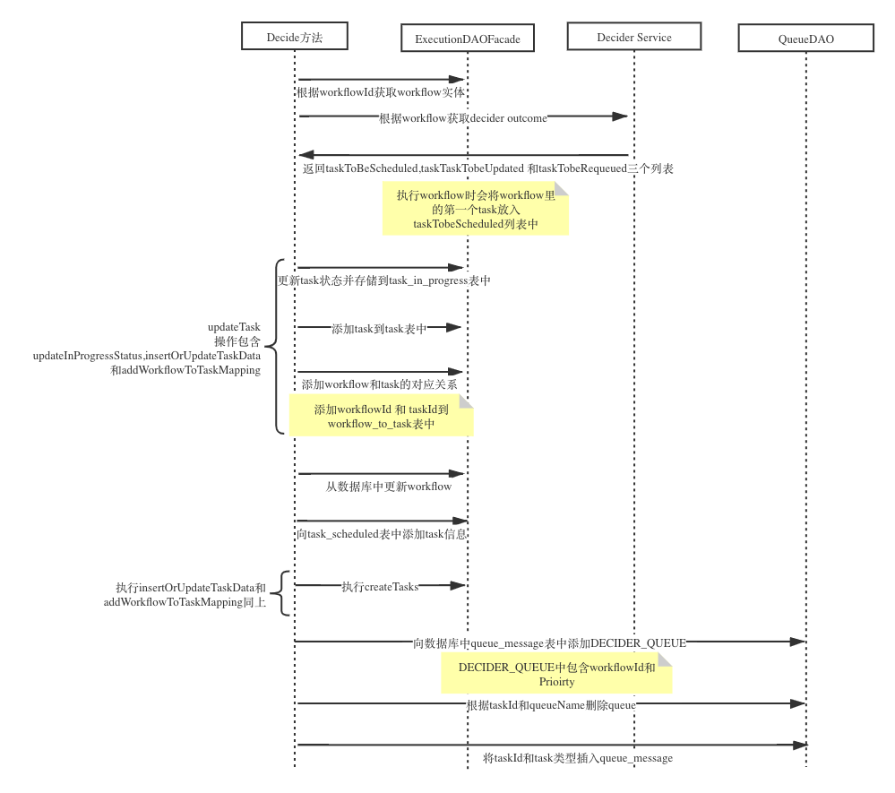
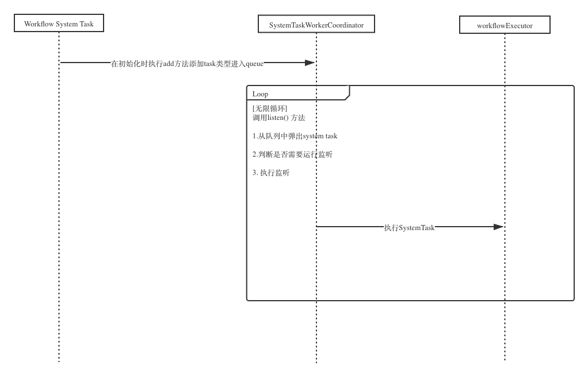
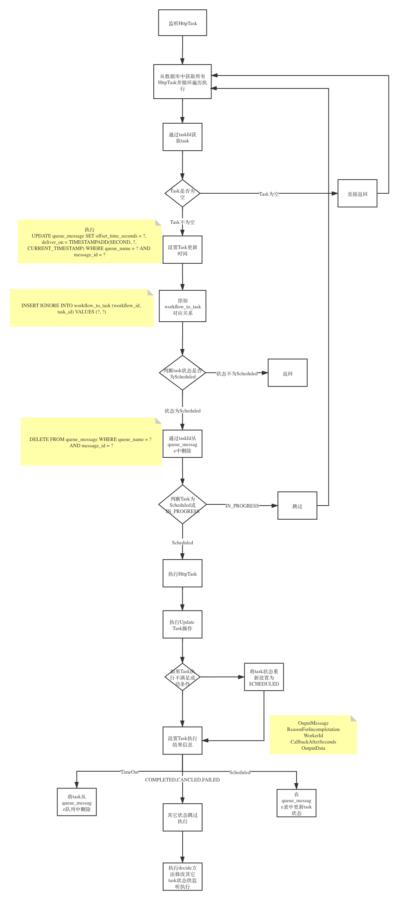
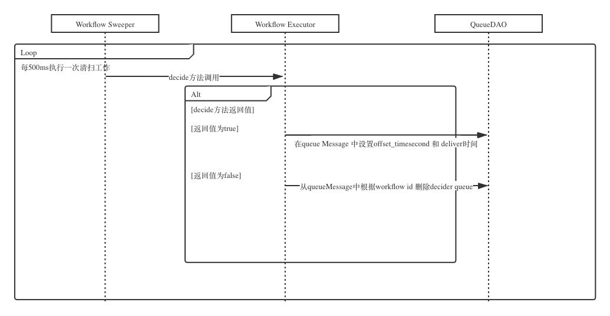

# Netflix Conductor 整体架构设计

# StartWorkflow 执行流程
## 执行流程
startWorkflow功能在调用接口时会先判断传入的workflow名称是否存在然后执行StartWorkflow 方法。

## Workflow Executor Start workflow 执行
* 添加workflow信息至数据库 （对workflow数据表的操作 包含：workflow_id，json_data，correlation_id）
* 添加workflow def 和 workflow的对应关系 （workflow_def_to_workflow数据表的操作 包含workflow_def(workflow的名称)，workflow_id）

* 执行decide方法

## decice 方法
1. 创建workflow实例
* 通过workflowId 获取workflow
* 获取workflow的 tasks （先从workflow_to_task表中取出当前workflow的所有taskId 然后通过taskId建立task实例并将列表返回） 并放入workflow实例。（第一次执行workflow时task为空）
2. 新建task列表实例
3. 新建 WorkflowTask 实例，并把第一个task附值给它作为taskToSchedule变量
4. 获取task 的 input 内容
5. 建立并返回task实例列表
6. 通过返回的task实例列表建立三个独立列表（tasksToBeScheduled，tasksToBeUpdated，tasksToBeRequeued）
7. 设置当前状态stateChanged为false
8. 将tasktoSchedule 存入workflow实例
9. 更新task操作
* 添加task到task数据表中
* 添加workflow和task的对应关系（添加对应关系到workflow_to_task表中）
10. 更新workflow操作
* 设置workflow更新时间
* 向数据库中workflow表中更新workflow
11. 将DECIDER_QUEUE存入queue_message
12. 将task添加至queue_message

# System Task worker coordinator 监听流程
1. 初始化linkedblockingqueue用于缓存task类型用于监听
2. 新建thread启动监听功能
3. 运行自旋操作
4. 从监听队列中弹出监听的task类型 （以Http task 为例）
5. 执行Http task
6. 从 queue_message 数据库表中取出所有HTTP task 并提交给Workflow Executor 执行
7. 获取并实例task
8. 通过task获取workflowId 并获取task所对应的workflow
9. 判断若当前的task状态如果是SCHEDULED则执行，若状态是IN_PROGRESS则不执行
10. 执行完毕后，将task传入TaskResult实体并执行更新操作
11. 设置task的ouputMessage, reasonForIncompletion, workerId,CallbackAfterSeconds 和 outputData
12. 从queue_message 中删除 Decider_Queue 和 对应的 HTTP name
13. 从数据库中更新task
14. 从 task_in_progress 数据表中将 当前task的信息删除
15. 执行workflowExcutor 的 decide 方法
16. 将下一个task标记为taskTobeScheduled供监听执行

## 监听流程

## System Task 执行流程

# Workflow Sweeper
通过ScheduledThreadPool每500ms执行一次workflow状态清扫工作
1. 调用 WorkflowExecutor 的 decide 方法
2. 若返回不为false则在queue Message 中设置offset_timesecond 和 deliver时间
若返回为fasle则从queueMessage中根据workflow id 删除decider queue
