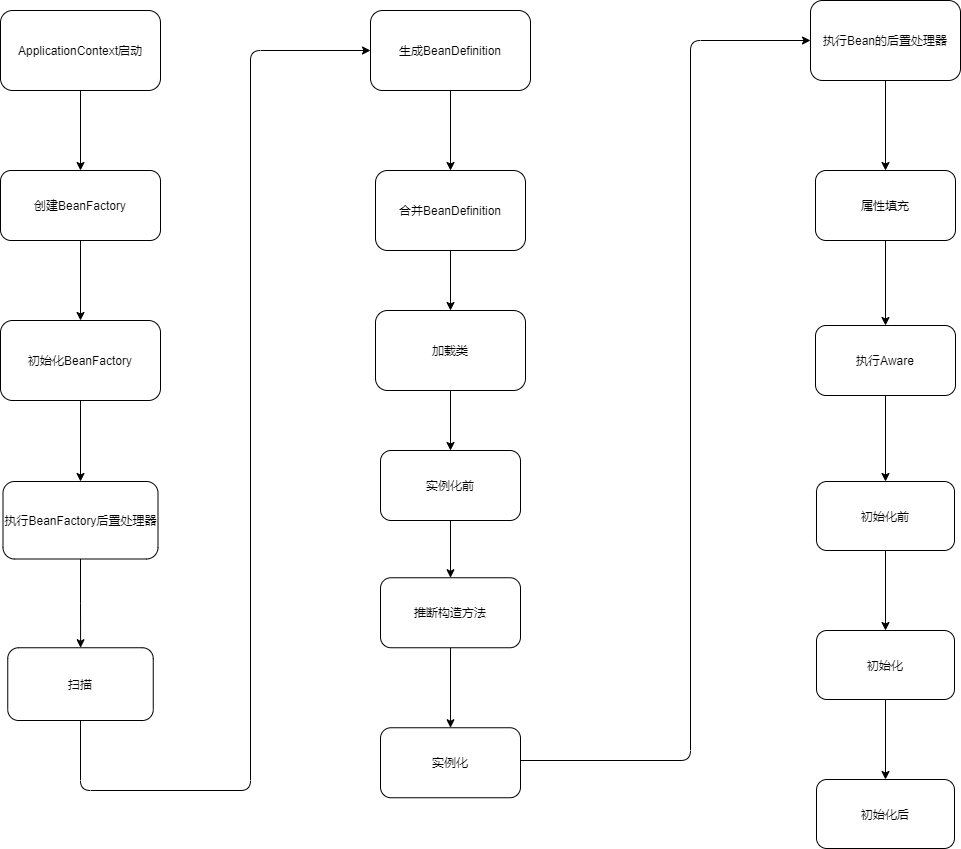

# Spring中Bean的生命周期


## BeanPostProcessor 的使用
BeanPostProcessor 接口定义了 postProcessBeforeInitialization 和 postProcessAfterInitialization 即初始化前和初始化后。

## InitializingBean 的使用
InitializingBean的接口定义了初始化时bean的属性设置之后阶段的拓展。

e.g.
```java
public class UserService implements InitializingBean, BeanPostProcessor {

    @Override
	public void afterPropertiesSet() throws Exception {
		System.out.println("初始化");
	}

	@Override
	public Object postProcessBeforeInitialization(Object bean, String beanName) throws BeansException {
		System.out.println("初始化前"+beanName);
		return bean;
	}

	@Override
	public Object postProcessAfterInitialization(Object bean, String beanName) throws BeansException {
		System.out.println("初始化后"+beanName);
		return bean;
	}

}
```

## InstantiationAwareBeanPostProcessor 的使用
InstantiationAwareBeanPostProcessor 继承了 BeanPostProcessor。 在此基础上添加了 postProcessBeforeInstantiation （实例化前）和 postProcessAfterInstantiation（实例化后）接口。
e.g.

## @PostConstruct 和 @PreDestory
@PostConstruct Bean实例构造后
@PreDestory Bean销毁前
```java
@Component
public class MyBeanPostProcessor implements InstantiationAwareBeanPostProcessor {


	@Override
	public Object postProcessBeforeInitialization(Object bean, String beanName) throws BeansException {
		System.out.println("初始化前"+beanName);
		return bean;
	}

	@PostConstruct
	public void init(){
		System.out.println("PostConstruct myBeanPostProcessor");
	}

	@PreDestroy
	public void destory(){
		System.out.println("PreDestory");
	}

	@Override
	public Object postProcessAfterInitialization(Object bean, String beanName) throws BeansException {
		System.out.println("初始化后"+beanName);
		return bean;
	}

	//实例化前
	@Override
	public Object postProcessBeforeInstantiation(Class<?> beanClass, String beanName) throws BeansException {
		if (beanName.equals("orderService")){
			System.out.println("实例化前："+beanName);
			return beanClass; //如果实例化前返回了值则直接执行初始化后
			//org.springframework.beans.factory.support.AbstractAutowireCapableBeanFactory.resolveBeforeInstantiation
		}
		System.out.println("实例化前："+beanName);
		return null;
	}

	//实力化后
	@Override
	public boolean postProcessAfterInstantiation(Object bean, String beanName) throws BeansException {
		if (beanName.equals("orderService")){
			System.out.println("实例化后："+beanName);
		}
		return true;
	}
}
```

如果实例化前返回了值则直接执行初始化后
源码位置：org.springframework.beans.factory.support.AbstractAutowireCapableBeanFactory.resolveBeforeInstantiation 
```java
protected Object resolveBeforeInstantiation(String beanName, RootBeanDefinition mbd) {
		Object bean = null;
		// beforeInstantiationResolved为null或true
		if (!Boolean.FALSE.equals(mbd.beforeInstantiationResolved)) {
			// Make sure bean class is actually resolved at this point.
			if (!mbd.isSynthetic() && hasInstantiationAwareBeanPostProcessors()) {
				Class<?> targetType = determineTargetType(beanName, mbd);
				if (targetType != null) {
					// 实例化前
					bean = applyBeanPostProcessorsBeforeInstantiation(targetType, beanName);
					if (bean != null) {
						bean = applyBeanPostProcessorsAfterInitialization(bean, beanName);
					}
				}
			}
			mbd.beforeInstantiationResolved = (bean != null);
		}
		return bean;
	}
```

## 核心源码
源码位置
org.springframework.beans.factory.support.AbstractAutowireCapableBeanFactory


### 初始化
源码位置
```org.springframework.beans.factory.support.AbstractAutowireCapableBeanFactory#initializeBean(java.lang.String, java.lang.Object, org.springframework.beans.factory.support.RootBeanDefinition)```
1. 执行Aware
2. 执行初始化前
3. 初始化
4. 初始化后 & AOP

```java
protected Object initializeBean(final String beanName, final Object bean, @Nullable RootBeanDefinition mbd) {
		if (System.getSecurityManager() != null) {
			AccessController.doPrivileged((PrivilegedAction<Object>) () -> {
				invokeAwareMethods(beanName, bean);
				return null;
			}, getAccessControlContext());
		}
		else {
			// 4.1、执行Aware
			invokeAwareMethods(beanName, bean);
		}

		Object wrappedBean = bean;
		if (mbd == null || !mbd.isSynthetic()) {
			// 4.2、初始化前
			wrappedBean = applyBeanPostProcessorsBeforeInitialization(wrappedBean, beanName);
		}

		try {
			// 4.3、初始化
			invokeInitMethods(beanName, wrappedBean, mbd);
		}
		catch (Throwable ex) {
			throw new BeanCreationException(
					(mbd != null ? mbd.getResourceDescription() : null),
					beanName, "Invocation of init method failed", ex);
		}
		if (mbd == null || !mbd.isSynthetic()) {
			// 4.4、初始化后 AOP  （）
			wrappedBean = applyBeanPostProcessorsAfterInitialization(wrappedBean, beanName);
		}

		return wrappedBean;
	}
```

初始化前：applyBeanPostProcessorsBeforeInitialization
```java
@Override
	public Object applyBeanPostProcessorsBeforeInitialization(Object existingBean, String beanName)
			throws BeansException {

		Object result = existingBean;
        //循环遍历BeanPostProcessor执行
		for (BeanPostProcessor processor : getBeanPostProcessors()) {
			// BPP1--》BPP2-->BPP3
			Object current = processor.postProcessBeforeInitialization(result, beanName);
			if (current == null) {
				return result;
			}
			result = current;
		}
		return result;
	}
```

初始化：invokeInitMethods
```java
protected void invokeInitMethods(String beanName, final Object bean, @Nullable RootBeanDefinition mbd)
			throws Throwable {

		boolean isInitializingBean = (bean instanceof InitializingBean);
		if (isInitializingBean && (mbd == null || !mbd.isExternallyManagedInitMethod("afterPropertiesSet"))) {
			if (logger.isTraceEnabled()) {
				logger.trace("Invoking afterPropertiesSet() on bean with name '" + beanName + "'");
			}
			if (System.getSecurityManager() != null) {
				try {
					AccessController.doPrivileged((PrivilegedExceptionAction<Object>) () -> {
						((InitializingBean) bean).afterPropertiesSet();
						return null;
					}, getAccessControlContext());
				}
				catch (PrivilegedActionException pae) {
					throw pae.getException();
				}
			}
			else {
				((InitializingBean) bean).afterPropertiesSet(); // 调用实例化的初始化方法
			}
		}

		if (mbd != null && bean.getClass() != NullBean.class) {
			String initMethodName = mbd.getInitMethodName();
			if (StringUtils.hasLength(initMethodName) &&
					!(isInitializingBean && "afterPropertiesSet".equals(initMethodName)) &&
					!mbd.isExternallyManagedInitMethod(initMethodName)) {
				invokeCustomInitMethod(beanName, bean, mbd);   // init-method=""
			}
		}
	}
```

初始化后
循环遍历postProcessor调用实例化的postProcessAfterInitialization()方法
```java
@Override
	public Object applyBeanPostProcessorsAfterInitialization(Object existingBean, String beanName)
			throws BeansException {

		Object result = existingBean;
		for (BeanPostProcessor processor : getBeanPostProcessors()) {
			Object current = processor.postProcessAfterInitialization(result, beanName);
			if (current == null) {
				return result;
			}
			result = current;
		}
		return result;
	}
```

### 实例化
源码位置：org.springframework.beans.factory.support.AbstractAutowireCapableBeanFactory#doCreateBean

```java
// 实例化
if (instanceWrapper == null) {
    // 创建bean实例 例如 new UserSerive()
    instanceWrapper = createBeanInstance(beanName, mbd, args);
}
```

createBeanInstance()方法

```java
protected BeanWrapper createBeanInstance(String beanName, RootBeanDefinition mbd, @Nullable Object[] args) {
		// 创建一个bean实例(返回一个原始对象)

		// Make sure bean class is actually resolved at this point.
		// 1. 得到bean的class，并验证class的访问权限是不是public
		Class<?> beanClass = resolveBeanClass(mbd, beanName);

		if (beanClass != null && !Modifier.isPublic(beanClass.getModifiers()) && !mbd.isNonPublicAccessAllowed()) {
			throw new BeanCreationException(mbd.getResourceDescription(), beanName,
					"Bean class isn't public, and non-public access not allowed: " + beanClass.getName());
		}

		// 2. Spring提供给开发者的扩展点
		// 如果我们要自己来实现创建对象的过程, 那么就可以提供一个Supplier的实现类,
		// 当一个BeanDefinition中存在一个Supplier实现类的时候, Spring就利用这个类的get方法来获取实例,
		// 而不再走Spring创建对象的逻辑
		Supplier<?> instanceSupplier = mbd.getInstanceSupplier();
		if (instanceSupplier != null) {
			return obtainFromSupplier(instanceSupplier, beanName);
		}

		// 3.通过factoryMethod实例化这个bean
		// factorMethod这个名称在xml中还是比较常见的, 即通过工厂方法来创建bean对象
		// 如果一个bean对象是由@Bean注解创建的, 那么该对象就会走instantiateUsingFactoryMethod方法来创建的
		if (mbd.getFactoryMethodName() != null) {
			return instantiateUsingFactoryMethod(beanName, mbd, args);
		}

		// Shortcut when re-creating the same bean...
		boolean resolved = false;
		boolean autowireNecessary = false;
		// 如果在创建bean时没有手动指定构造方法的参数，那么则看当前BeanDefinition是不是已经确定了要使用的构造方法和构造方法参数
		// 注意：如果没有手动指定参数，那么就肯定时自动推断出来的，所以一旦发现当前BeanDefinition中已经确定了要使用的构造方法和构造方法参数，
		// 那么就要使用autowireConstructor()方法来构造一个bean对象
		if (args == null) {
			synchronized (mbd.constructorArgumentLock) {
				// 该BeanDefinition是否已经决定了要使用的构造方法或工厂方法
				if (mbd.resolvedConstructorOrFactoryMethod != null) {
					resolved = true;
					// 该BeanDefinition是否已经决定了要使用的构造方法参数
					autowireNecessary = mbd.constructorArgumentsResolved;
				}
			}
		}
		if (resolved) {
			// resolved为true，表示当前bean的构造方法已经确定出来了
			// autowireNecessary表示
			if (autowireNecessary) {
				return autowireConstructor(beanName, mbd, null, null);
			}
			else {
				// 如果构造方法已经确定了，但是没有确定构造方法参数，那就表示没有构造方法参数，用无参的构造方法来实例化bean
				return instantiateBean(beanName, mbd);
			}
		}

		// Candidate constructors for autowiring?
		Constructor<?>[] ctors = determineConstructorsFromBeanPostProcessors(beanClass, beanName);

		// 通过BeanPostProcessor找出了构造方法
		// 或者BeanDefinition的autowire属性为AUTOWIRE_CONSTRUCTOR
		// 或者BeanDefinition中指定了构造方法参数值
		// 或者在getBean()时指定了args
		if (ctors != null || mbd.getResolvedAutowireMode() == AUTOWIRE_CONSTRUCTOR ||
				mbd.hasConstructorArgumentValues() || !ObjectUtils.isEmpty(args)) {
			// 进行构造方法推断并实例化
			return autowireConstructor(beanName, mbd, ctors, args);
		}

		// Preferred constructors for default construction?
		ctors = mbd.getPreferredConstructors();
		if (ctors != null) {
			return autowireConstructor(beanName, mbd, ctors, null);
		}

		// No special handling: simply use no-arg constructor.
		// 用无参的构造方法来实例化bean
		return instantiateBean(beanName, mbd);
	}
```

### 填充属性
源码位置：org.springframework.beans.factory.support.AbstractAutowireCapableBeanFactory#populateBean

```java
protected void populateBean(String beanName, RootBeanDefinition mbd, @Nullable BeanWrapper bw) {
		if (bw == null) {
			if (mbd.hasPropertyValues()) {
				throw new BeanCreationException(
						mbd.getResourceDescription(), beanName, "Cannot apply property values to null instance");
			}
			else {
				// Skip property population phase for null instance.
				return;
			}
		}

		// Give any InstantiationAwareBeanPostProcessors the opportunity to modify the
		// state of the bean before properties are set. This can be used, for example,
		// to support styles of field injection.
		// 可以提供InstantiationAwareBeanPostProcessor，控制对象的属性注入
		// 我们可以自己写一个InstantiationAwareBeanPostProcessor，然后重写postProcessAfterInstantiation方法返回false,那么则不会进行属性填充了
		if (!mbd.isSynthetic() && hasInstantiationAwareBeanPostProcessors()) {
			for (BeanPostProcessor bp : getBeanPostProcessors()) {
				if (bp instanceof InstantiationAwareBeanPostProcessor) {
					InstantiationAwareBeanPostProcessor ibp = (InstantiationAwareBeanPostProcessor) bp;
					if (!ibp.postProcessAfterInstantiation(bw.getWrappedInstance(), beanName)) {
						return;
					}
				}
			}
		}

		// 是否在BeanDefinition中设置了属性值
		PropertyValues pvs = (mbd.hasPropertyValues() ? mbd.getPropertyValues() : null);

		//  autowire属性
		int resolvedAutowireMode = mbd.getResolvedAutowireMode();  // BeanDefinition AutowireMode
		if (resolvedAutowireMode == AUTOWIRE_BY_NAME || resolvedAutowireMode == AUTOWIRE_BY_TYPE) {
			// by_name是根据根据属性名字找bean
			// by_type是根据属性所对应的set方法的参数类型找bean
			// 找到bean之后都要调用set方法进行注入

			MutablePropertyValues newPvs = new MutablePropertyValues(pvs);
			// Add property values based on autowire by name if applicable.
			if (resolvedAutowireMode == AUTOWIRE_BY_NAME) {
				autowireByName(beanName, mbd, bw, newPvs);
			}
			// Add property values based on autowire by type if applicable.
			if (resolvedAutowireMode == AUTOWIRE_BY_TYPE) {
				autowireByType(beanName, mbd, bw, newPvs);
			}
			pvs = newPvs;

			// 总结一下
			// 其实就是Spring自动的根据某个类中的set方法来找bean，byName就是根据某个set方法所对应的属性名去找bean
			// byType，就是根据某个set方法的参数类型去找bean
			// 注意，执行完这里的代码之后，这是把属性以及找到的值存在了pvs里面，并没有完成反射赋值
		}

		// 执行完了Spring的自动注入之后，就开始解析@Autowired，这里叫做实例化回调
		boolean hasInstAwareBpps = hasInstantiationAwareBeanPostProcessors();
		boolean needsDepCheck = (mbd.getDependencyCheck() != AbstractBeanDefinition.DEPENDENCY_CHECK_NONE);


		// @AUtowired注解的 AutowiredAnnotationBeanPostProcessor
		// @Resource注解的 CommonAnnotationBeanPostProcessor
		PropertyDescriptor[] filteredPds = null;
		if (hasInstAwareBpps) {
			if (pvs == null) {
				pvs = mbd.getPropertyValues();
			}
			for (BeanPostProcessor bp : getBeanPostProcessors()) {
				if (bp instanceof InstantiationAwareBeanPostProcessor) {
					InstantiationAwareBeanPostProcessor ibp = (InstantiationAwareBeanPostProcessor) bp;

					// 调用BeanPostProcessor分别解析@Autowired、@Resource、@Value，得到属性值
					PropertyValues pvsToUse = ibp.postProcessProperties(pvs, bw.getWrappedInstance(), beanName);

					if (pvsToUse == null) {
						if (filteredPds == null) {
							filteredPds = filterPropertyDescriptorsForDependencyCheck(bw, mbd.allowCaching);
						}
						pvsToUse = ibp.postProcessPropertyValues(pvs, filteredPds, bw.getWrappedInstance(), beanName);
						if (pvsToUse == null) {
							return;
						}
					}
					pvs = pvsToUse;
				}
			}
		}
		if (needsDepCheck) {
			if (filteredPds == null) {
				filteredPds = filterPropertyDescriptorsForDependencyCheck(bw, mbd.allowCaching);
			}
			checkDependencies(beanName, mbd, filteredPds, pvs);
		}

		if (pvs != null) {
			// pvs存的就是属性已经对应的值
			applyPropertyValues(beanName, mbd, bw, pvs);
		}
	}
```