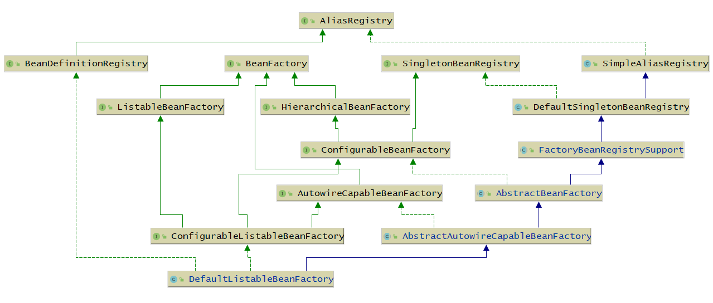
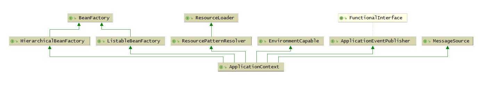
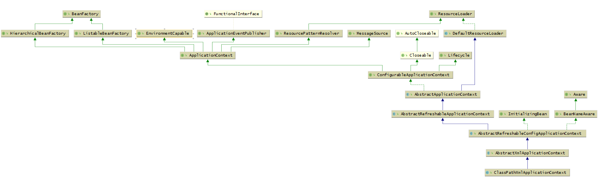

# Spring 核心概念

# Spring 中定义Bean的方式
* ```<bean/>```
* ```@Bean```
* ```@Component(@Service,@Controller)```
* ```BeanDefinition```


## BeanDefinition 定义Bean
```Java
// 定义一个BeanDefinition
AbstractBeanDefinition beanDefinition = BeanDefinitionBuilder.genericBeanDefinition().getBeanDefinition();
// 定义Bean对象的类型
beanDefinition.setBeanClass(User.class);

// 将BeanDefinition注册到BeanFactory中
DefaultListableBeanFactory beanFactory = new DefaultListableBeanFactory();
beanFactory.registerBeanDefinition("user", beanDefinition);

// 获取Bean
System.out.println(beanFactory.getBean("user"));
```

设置Bean属性：
```Java
beanDefinition.setScope("prototype"); // 设置作用域 默认为singleton(单例)
beanDefinition.setInitMethodName("init Method"); // 设置初始化方法
beanDefinition.setAutowireMode(AutowireCapableBeanFactory.AUTOWIRE_BY_TYPE); // 设置自动装配模型
```

# BeanDefinitionReader
BeanDefinitionReader 是一个将Bean转化为BeanDefinition的工具（接口）

## AnnotatedBeanDefinitionReader
将类转换为 BeanDefinition 并解析该类上的注解
包含：@Conditional，@Scope、@Lazy、@Primary、@DependsOn、@Role、@Description

e.g.
```Java
DefaultListableBeanFactory beanFactory = new DefaultListableBeanFactory();
AnnotatedBeanDefinitionReader annotatedBeanDefinitionReader = new AnnotatedBeanDefinitionReader(beanFactory);

//注册User类
annotatedBeanDefinitionReader.register(User.class);

System.out.println(beanFactory.getBean("user"));
```

## XmlBeanDefinitionReader
通过解析XML中的```</bean>```标签
```Java
XmlBeanDefinitionReader xmlBeanDefinitionReader = new XmlBeanDefinitionReader(beanFactory);

int i = xmlBeanDefinitionReader.loadBeanDefinitions("spring.xml");

System.out.println(beanFactory.getBean("user"));
```

## ClassPathBeanDefinitionScanner
进行包扫描，扫描某个包下的路径，对扫描到的类进行解析，比如，扫描到的类上如果存在@Component注解，那么就会把这个类解析为一个BeanDefinition

# BeanFactory
整体结构

## DefaultListableBeanFactory
实现的核心功能：
* AliasRegistry: 别名功能
* BeanDefinitionRegistry: 可以用来注册BeanDefinition
* BeanFactory: Bean工厂，可以根据某个bean的名字、或类型、或别名获取某个Bean对象
* SingletonBeanRegistry: 注册，获取单例bean
* SimpleAliasRegistry: 一个实现了AliasRegistry接口中所定义的功能的类，支持别名功能
* ListableBeanFactory: 在BeanFactory的基础上，增加了其他功能，可以获取所有BeanDefinition的beanNames，可以根据某个类型获取对应的beanNames，可以根据某个类型获取{类型：对应的Bean}的映射关系
* HierarchicalBeanFactory: 在BeanFactory的基础上，添加了获取父类BeanFactory的功能
* DefaultSingletonBeanRegistry: 实现了SingletonBeanRegistry接口，拥有了直接注册、获取某个单例Bean的功能
* ConfigurableBeanFactory: 在HierarchicalBeanFactory和SingletonBeanRegistry的基础上，添加了设置父BeanFactory、类加载器（表示可以指定某个类加载器进行类的加载）、设置Spring EL表达式解析器（表示该BeanFactory可以解析EL表达式）、设置类型转化服务（表示该BeanFactory可以进行类型转化）、可以添加BeanPostProcessor（表示该BeanFactory支持Bean的后置处理器），可以合并BeanDefinition，可以销毁某个Bean等等功能
* FactoryBeanRegistrySupport: 支持FactoryBean的功能
* AutowireCapableBeanFactory: 直接继承了BeanFactory，在BeanFactory的基础上，支持在创建Bean的过程中能对Bean进行自动装配
* AbstractBeanFactory
* ConfigurableListableBeanFactory
* AbstractAutowireCapableBeanFactory
* DefaultListableBeanFactory


# ApplicationContext
整体结构

* HierarchicalBeanFactory: 拥有获取父BeanFactory的功能
* ListableBeanFactory: 拥有获取beanNames的功能
* ResourcePatternResolver: 资源加载器，可以一次性获取多个资源（文件资源等等）
* EnvironmentCapable: 可以获取运行时环境（没有设置运行时环境功能）
* ApplicationEventPublisher: 拥有广播事件的功能（没有添加事件监听器的功能）
* MessageSource: 拥有国际化功能

## 常用的比较重要的实现类
### AnnotationConfigApplicationContext
整体结构

* ConfigurableApplicationContext：继承了ApplicationContext接口，增加了，添加事件监听器、添加BeanFactoryPostProcessor、设置Environment，获取ConfigurableListableBeanFactory等功能
* AbstractApplicationContext：实现了ConfigurableApplicationContext接口
* GenericApplicationContext：继承了AbstractApplicationContext，实现了BeanDefinitionRegistry接口，拥有了所有ApplicationContext的功能，并且可以注册BeanDefinition，这个类中有一个属性(DefaultListableBeanFactory beanFactory)
* AnnotationConfigRegistry：可以单独注册某个为类为BeanDefinition（可以处理该类上的@Configuration注解，已经可以处理@Bean注解），同时可以扫描
* AnnotationConfigApplicationContext：继承了GenericApplicationContext，实现了AnnotationConfigRegistry接口，拥有了以上所有的功能

### ClassPathXmlApplicationContext
整体结构


# 国际化使用示例
```Java
@Bean
public MessageSource messageSource() {
    ResourceBundleMessageSource messageSource = new ResourceBundleMessageSource();
    messageSource.setBasename("messages");
    return messageSource;
}
```

```Java
annotationConfigApplicationContext.getMessage("test", null, new Locale("en_CN"))
```

# 资源加载示例
```Java
Resource resource = annotationConfigApplicationContext.getResource("your_class_file_path");
System.out.println(resource);
```

```Java
Resource[] resources = annotationConfigApplicationContext.getResources("classpath:com/myservice/service/*.class");
for (Resource resource : resources) {
    System.out.println(resource.contentLength());
}
```

# 环境参数获取

* 获取JVM所允许的操作系统的环境
```Java
annotationConfigApplicationContext.getEnvironment().getSystemEnvironment();
```

* 获取JVM本身的一些属性，包括-D所设置的
```Java
annotationConfigApplicationContext.getEnvironment().getSystemProperties();
```

* 直接获取某个环境或properties文件中的属性
```Java
annotationConfigApplicationContext.getEnvironment().getProperty("lubanyyy")
```
通过注解获取：
```Java
@PropertySource("classpath:application.properties")
```

# 事件发布
```Java
@Bean
public ApplicationListener applicationListener() {
    return new ApplicationListener() {
        @Override
        public void onApplicationEvent(ApplicationEvent event) {
            System.out.println("接收到了一个事件");
        }
    };
}
```

```Java
annotationConfigApplicationContext.publishEvent("publish event");
```

# 类型转化

## PropertyEditor
JDK 转化工具类：
```Java
public class StringToUserPropertyEditor extends PropertyEditorSupport implements PropertyEditor {

    @Override
    public void setAsText(String text) throws IllegalArgumentException {
        User user = new User();
        user.setName(text);
        this.setValue(user);
    }
}
```

```java
StringToUserPropertyEditor propertyEditor = new StringToUserPropertyEditor();
propertyEditor.setAsText("1");
User value = (User) propertyEditor.getValue();
System.out.println(value);
```

向Spring注册
```Java
@Bean
public CustomEditorConfigurer myCustomEditorConfigurer() {
    CustomEditorConfigurer customEditorConfigurer = new CustomEditorConfigurer();
    Map<Class<?>, Class<? extends PropertyEditor>> propertyEditorMap = new HashMap<>();
    propertyEditorMap.put(User.class, StringToUserPropertyEditor.class);
    customEditorConfigurer.setCustomEditors(propertyEditorMap);
    return customEditorConfigurer;
}
```

赋值：
```java
@Component
public class UserService {

    @Value("true")
    User test;

    public void test() {
        System.out.println(test);
    }
}
```

## ConversionService
e.g.
```java 
public class StringToUserConverter implements ConditionalGenericConverter {

    @Override
    public boolean matches(TypeDescriptor sourceType, TypeDescriptor targetType) {
        return sourceType.getType().equals(String.class) && targetType.getType().equals(User.class);
    }

    @Override
    public Set<ConvertiblePair> getConvertibleTypes() {
        return Collections.singleton(new ConvertiblePair(String.class, User.class));
    }

    @Override
    public Object convert(Object source, TypeDescriptor sourceType, TypeDescriptor targetType) {
        User user = new User();
        user.setName((String)source);
        return user;
    }
}
```

```java
DefaultConversionService conversionService = new DefaultConversionService();
conversionService.addConverter(new StringToUserConverter());
User value = conversionService.convert("1", User.class);
System.out.println(value);
```

注册ConversionService
```java
@Bean
public ConversionServiceFactoryBean conversionService() {
    ConversionServiceFactoryBean conversionServiceFactoryBean = new ConversionServiceFactoryBean();
    conversionServiceFactoryBean.setConverters(Collections.singleton(new StringToUserConverter()));

    return conversionServiceFactoryBean;
}
```

## TypeConverter (Spring内部使用)
```java
SimpleTypeConverter typeConverter = new SimpleTypeConverter();
typeConverter.registerCustomEditor(User.class, new StringToUserPropertyEditor());
User value = typeConverter.convertIfNecessary("1", User.class);
System.out.println(value);
```