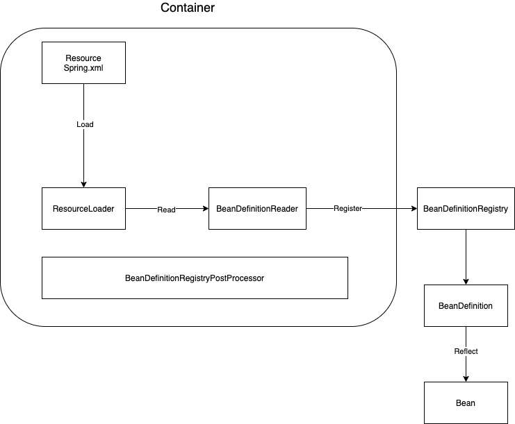

# Spring 整体架构图


# IOC 概念
## 官网原文
IOC is also known as dependency injection(DI). It is a process whereby objects define their dependencies (that is, the other objects they work with) only through constructor arguments, arguments to a factory method, or propertied that are set on the object instance after it is constructed or returned from a factory method. The container then injects those dependencied when it creates the bean. This process is fundamentally the inverse (hence the namem, Inversion of Control) of the bean itself controlling the instantiation or location of its dependencies by using direct construction of classes or a mechanism such as the Service Locator pattern.

**IoC**(Inversion of Control) 也称为**依赖注入**(dependency injection, DI)。它是一个==对象定义依赖关系的过程==，也就是说，对象只通过构造函数参数、工厂方法的参数或对象实例构造或从工厂方法返回后在对象实例上设置的属性来定义它们所使用的其他对象。然后==容器在创建bean时注入这些依赖项==。这个过程基本上是bean的逆过程，因此称为**控制反转**(IoC)

IoC容器：通过容器统一对象的构建方式，并且自动维护对象的依赖关系。
## IOC 容器工作流程(以XML为例)

1. ResourceLoader 加载 XML文件中定义的bean
2. BeanDefinitionReader 读取Resource Loader 中的 bean信息
3. BeanDefinitionRegistry 注册bean信息
4. BeanDefinition 获取注册的bean信息。 所有的bean definition将缓存到 ConcurrentHashmap (BeanDefinitionMap) key: beanName, value: beanDefinition。单例池中存储所有单例bean的信息(key: beanName, value: bean object)
5. 通过反射调用bean

# IOC 的应用
## bean 的装配方式
### XML
```xml
<?xml version="1.0" encoding="UTF-8"?>
<beans xmlns="http://www.springframework.org/schema/beans"
       xmlns:xsi="http://www.w3.org/2001/XMLSchema-instance"
       xsi:schemaLocation="http://www.springframework.org/schema/beans
        https://www.springframework.org/schema/beans/spring-beans.xsd">

    <bean id="user"  class="com.bean.User"/>

</beans>
```

```Java
ApplicationContext context = new ClassPathXmlApplicationContext("spring.xml");
```

### @ImportResource
```java
@ImportResource("spring.xml")
public class AppConfig {

}
```

```java
 ApplicationContext context = new AnnotationConfigApplicationContext(AppConfig.class);
```

### FactoryBean 实现
```java
public class MyFactroyBean  implements FactoryBean {
   @Override
   public Object getObject() throws Exception {
      return new User();
   }

   @Override
   public Class<?> getObjectType() {
      return User.class;
   }
}
```
```java
AbstractBeanFactory#getObjectForBeanInstance
!(beanInstance instanceof FactoryBean) || BeanFactoryUtils.isFactoryDereference(name)
```

### @Component+@ComponentScan
@ComponentScan默认扫描: @Component, @Repository，@Service, @Controller
```java
@ComponentScan("com.carl.service")
public class AppConfig {
}
```
```java
ApplicationContext context = new AnnotationConfigApplicationContext(AppConfig.class);
```
#### @ComponentScan 扩展用法
* 排除 excludeFilters  

```java
@ComponentScan(basePackages = "com.carl.service",excludeFilters = {
    @ComponentScan.Filter(type = FilterType.ANNOTATION,value = {Service.class}),
    @ComponentScan.Filter(type = FilterType.ASSIGNABLE_TYPE,value = {User.class})
})
```

* 包含 includeFilters
```java
@ComponentScan(basePackages = "com.carl.service",includeFilters = {
    @ComponentScan.Filter(type = FilterType.CUSTOM,value = {CustomTypeFilter.class})
},useDefaultFilters = false)
```

FilterType.CUSTOM实现自定义过滤规则
```java
public class CustomTypeFilter implements TypeFilter {
    @Override
    public boolean match(MetadataReader metadataReader, MetadataReaderFactory metadataReaderFactory) throws IOException {
        
        ClassMetadata classMetadata = metadataReader.getClassMetadata();
        if (classMetadata.getClassName().contains("Service")) {
            return true;
        }
        return false;
    }
}
```

### @Bean+ @Configuration
```java
@Configuration
public class AppConfig {

    @Bean
    public User user(){
        return new User();
    }

    @Bean
    public UserService userService(){
        // 调用其他@Bean方法
        return new UserService(user());
    }
}
```
配置@Configuration与不配置的区别：
不配置@Configuration当内部method bean发生彼此依赖的时候会导致多例

#### @Configuration 的作用：
* 表明当前类是一个配置类，是方法bean的源
* 将@Configuration配置的AppConfig的BeanDefinitioin属性赋值为full类型，保证AppConfig类型可以转变为cglib类型
* 将@Configuration配置的AppConfig由普通类型转变为cglib代理类型，最后会生成cglib代理对象，通过代理对象的方法拦截器，可以解决AppConfig内部方法bean之间发生依赖调用的时候从容器中去获取，避免了多例的出现。

### @Import
```java
@Import(value = MyImportBeanDefinitionRegistrar.class)
public class AppConfig {
}
```